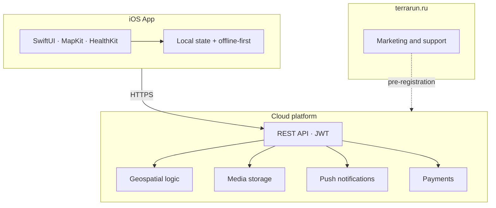

# Technology platform

English · [Русский](../platform.md)

High-level description for due diligence. **Implementation details, data schemas, and internal APIs are not published.**

---

## Architecture

---

## Stack (public summary)

| Layer | Technologies |
|-------|--------------|
| **Client** | iOS 17+, SwiftUI, MapKit, HealthKit, StoreKit 2 |
| **Server** | Go, PostgreSQL + PostGIS, Redis, object storage |
| **Infrastructure** | Docker, nginx, SSL, CI/CD, monitoring |
| **Integrations** | Apple / VK / email auth, APNs, payment providers |

---

## Platform domains

Public list of API capabilities (without contracts or endpoints):

- Authentication and profiles
- Territories and route geometry
- Training and trail flags
- Social graph: feed, clubs, events, chats
- World Journey and geo activities
- Subscriptions and payments
- Push notifications
- AI coach (in development)

**For technical partners:** we provide a brief and API access terms on request — [dev@terrarun.ru](mailto:dev@terrarun.ru).

---

## Principles

- **Offline-first** on the client — the app works without network; sync runs in the background.
- **Server-side geometry** — territory conflicts are resolved on the platform.
- **Privacy** — personal data is processed per the [privacy policy](https://terrarun.ru/privacy.html).

---

## Intentionally not disclosed

- Source code and development repository structure
- Database schemas and migrations
- Production infrastructure configuration
- Internal admin tools and operational procedures
- Detailed OpenAPI specifications (available to partners under NDA)
