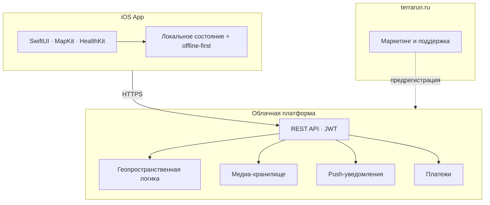

# Технологическая платформа

Высокоуровневое описание для due diligence. **Детали реализации, схемы данных и внутренние API не публикуются.**

---

## Архитектура

---

## Стек (публичная сводка)

| Слой | Технологии |
|------|------------|
| **Клиент** | iOS 17+, SwiftUI, MapKit, HealthKit, StoreKit 2 |
| **Сервер** | Go, PostgreSQL + PostGIS, Redis, object storage |
| **Инфраструктура** | Docker, nginx, SSL, CI/CD, мониторинг |
| **Интеграции** | Apple / VK / email auth, APNs, платёжные провайдеры |

---

## Домены платформы

Публичный перечень возможностей API (без контрактов и эндпоинтов):

- Аутентификация и профили
- Территории и геометрия маршрутов
- Тренировки и trail flags
- Социальный граф: лента, клубы, события, чаты
- World Journey и гео-активности
- Подписки и платежи
- Push-уведомления
- ИИ-тренер (в разработке)

**Для технических партнёров:** по запросу предоставляем brief и условия доступа к API — [dev@terrarun.ru](mailto:dev@terrarun.ru).

---

## Принципы

- **Offline-first** на клиенте — приложение работает без сети, синхронизация в фоне.
- **Серверная геометрия** — конфликты территорий решаются на стороне платформы.
- **Приватность** — персональные данные обрабатываются согласно [политике конфиденциальности](https://terrarun.ru/privacy.html).

---

## Что намеренно не раскрывается

- Исходный код и структура репозиториев разработки
- Схемы базы данных и миграции
- Конфигурация production-инфраструктуры
- Внутренние админ-инструменты и операционные процедуры
- Детальные OpenAPI-спецификации (доступны партнёрам по NDA)
